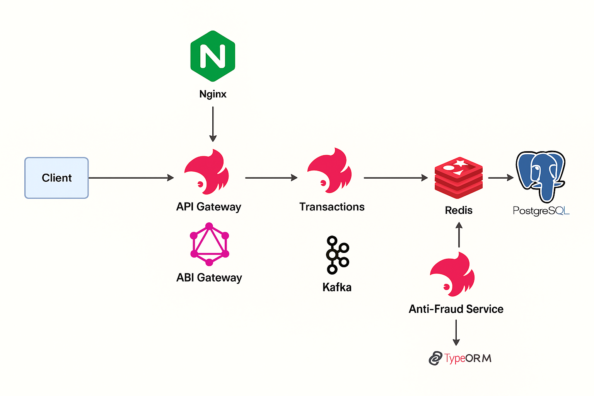

# Transaction & Anti-Fraud Microservices Architecture
<p align="center">
  
</p>

## Diagram Explanation

### Client → API Gateway → Transaction-Service
- The client sends a `createTransaction` request (e.g. via GraphQL) to the API Gateway.  
- The API Gateway publishes an event named `transaction.initiate` on Kafka.  
- The **Transaction-Service** consumes `transaction.initiate`, creates a new transaction record in the database with its `status` set to **`pending`**, and then emits a `transaction.created` event.  

---

## Transaction-Service → Saves Pending Transaction → PostgreSQL
- Upon consuming the `transaction.initiate` message, Transaction-Service persists a new row in the `transactions` table.  
- This row has the following fields:
  - `id` (UUID)  
  - `accountExternalIdDebit` (Guid)  
  - `accountExternalIdCredit` (Guid)  
  - `tranferTypeId` (integer)  
  - `value` (numeric)  
  - `status` (enum: `pending` | `approved` | `rejected`, defaults to **`pending`**)  
  - `createdAt` (timestamp)  

---

## Transaction-Service → `transaction.created` → Anti-Fraud-Service
- Once the “pending” transaction is saved, Transaction-Service emits `transaction.created`, including the newly created transaction’s details (ID, debit/credit accounts, transfer type, value, status, timestamp).  
- The **Anti-Fraud-Service** subscribes to the `transaction.created` topic and receives that event in real time.  

---

## Anti-Fraud-Service Evaluates → Emits Status Event
- Upon receiving a `transaction.created` event, Anti-Fraud-Service runs its fraud-detection logic (for example: if `value < 1000` → **approved**, else **rejected**).  
- Depending on the result, Anti-Fraud-Service emits one of two events on Kafka:
  - `transaction.status.update` with payload  
    ```json
    { 
      "id": "<transactionId>", 
      "status": "approved" 
    }
    ```
  - `transaction.status.update` with payload  
    ```json
    { 
      "id": "<transactionId>", 
      "status": "rejected" 
    }
    ```

---

## Anti-Fraud → Transaction-Service → Update Database
- Transaction-Service also subscribes to the `transaction.status.update` topic.  
- When it consumes a status update (either **approved** or **rejected**), it updates the corresponding `transactions` row in PostgreSQL by changing the `status` column from **`pending`** to either **`approved`** or **`rejected`**.  

